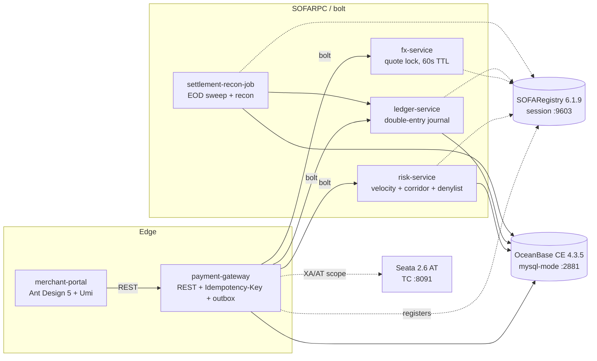

# PayLab — cross-border payments learning lab

A minimum-viable cross-border payment platform built deliberately on the **Ant Group /
Alibaba open-source stack**: SOFABoot, SOFARPC, SOFARegistry, Seata, SOFATracer, OceanBase,
Ant Design/Umi — reproducible on one laptop, deployable to **GCP and Alibaba Cloud** from the
same codebase. It is a learning lab: pattern correctness over feature breadth. No real money,
no real PII, synthetic data only.

## Architecture (target MVP)



Payment lifecycle: `CREATED → RISK_APPROVED → CAPTURED → SETTLED` with branches
`RISK_DECLINED`, `FAILED`, `REFUNDED`. Risk (denylist + corridor cap + velocity) gates
create; capture/refund state change + ledger posting are atomic via **Seata 2.6 AT**
(ADR-0004), with a forced-rollback e2e proving it. The end-to-end processing flow — state
machine, idempotency, risk rules, FX quote lock, ledger legs, Seata branches, outbox — is
documented in [docs/payment-flow.md](docs/payment-flow.md).

## Quickstart (local)

Prereqs: Docker (Compose v2), ~12 GB free RAM. JDK 17 + Maven only needed for the dev loop —
container images build in Docker.

```bash
# full local stack: OceanBase + SOFARegistry + 5 services
docker compose up -d --build

# watch until everything is healthy (OceanBase mini-mode bootstrap takes ~3-5 min)
docker compose ps

# proof-of-registration: each service publishes io.paylab.api.PingFacade into SOFARegistry
curl -s "http://localhost:9603/digest/getDataInfoIdList"
#   -> ["io.paylab.api.PingFacade:1.0@DEFAULT#@#DEFAULT_INSTANCE_ID#@#SOFA"]
./scripts/verify-phase0.sh   # full gate check (registry roles, OB canary, 5 services, 5 publishers)

# service health
curl -s http://localhost:8080/actuator/health   # payment-gateway (risk 8081, fx 8082, ledger 8083, recon 8084)

# dev loop without docker
mvn -B verify          # build + unit tests + spotless lint  (mvn spotless:apply to fix format)

# e2e gate (Phase 1): lifecycle tests against the running stack (ADR-0003)
./scripts/wait-healthy.sh 7 600 && mvn -Pe2e -pl e2e-tests -am test
```

### Payment API (Phase 1)

Every mutating call requires an `Idempotency-Key` header; replays return the original
response with `X-Idempotent-Replay: true`. Every response carries `X-PayLab-Trace-Id`.

```bash
# create (risk check stubbed as auto-approve until Phase 2) -> RISK_APPROVED
curl -s -X POST localhost:8080/api/payments \
  -H 'Content-Type: application/json' -H "Idempotency-Key: demo-$RANDOM" \
  -d '{"payerId":"payer-1","merchantId":"merchant-1","sourceCurrency":"SGD","targetCurrency":"MYR","amount":100.0000}'

# capture: locks a 60s fx quote, posts balanced double-entry legs, -> CAPTURED
curl -s -X POST localhost:8080/api/payments/<id>/capture -H "Idempotency-Key: cap-$RANDOM"

# refund (reversing ledger entry, -> REFUNDED), detail, timeline, ledger proof
curl -s -X POST localhost:8080/api/payments/<id>/refund -H "Idempotency-Key: ref-$RANDOM"
curl -s localhost:8080/api/payments/<id>
curl -s localhost:8080/api/payments/<id>/events
curl -s localhost:8080/api/trial-balance          # balanced:true, nets 0.0000 per currency
```

Capture posts five legs that net to zero per currency (`amount` A in source ccy, fee F,
target T = round4(A×rate)): payer wallet **DR A+F** / fee revenue **CR F** / FX P&L **CR A**
(source ccy) and FX P&L **DR T** / settlement clearing **CR T** (target ccy). The EOD sweep
(Phase 3) moves clearing → merchant payable.

Tear down: `docker compose down -v` (`-v` drops the OceanBase data volume).

## Repo layout

```
libs/                 shared modules: paylab-rpc-api (RPC facades/DTOs), paylab-common
services/             payment-gateway | risk-service | fx-service | ledger-service | settlement-recon-job
deploy/docker/        service + sofa-registry Dockerfiles
deploy/compose/       OceanBase init SQL
docs/adr/             architecture decision records
infra/                terraform (Phase 4): modules + envs/gcp + envs/alicloud
slo/  runbooks/  perf/ SRE artifacts (Phases 2-5)
versions.md           single source of truth for every pinned version
```

## Phase status

| Phase | Gate | Status |
|---|---|---|
| 0 — Skeleton | compose up: OceanBase + empty SOFABoot services registered in SOFARegistry | ✅ done |
| 1 — Payment core | e2e happy path + idempotency replay green | ✅ done |
| 2 — Risk + Seata | forced-rollback test + k6 latency targets | ⏳ next |
| 3 — Frontend + recon | portal shows payment e2e; recon clean | — |
| 4 — Cloud out | same Helm release healthy on GKE + ACK | — |
| 5 — Stretch | MOSN ingress, burn-rate drill, chaos | — |

## Decisions & versions

- Every version is pinned in [versions.md](versions.md) — verified against official repos.
- Deviations/choices are ADRs in [docs/adr/](docs/adr/):
  [ADR-0001 service registry](docs/adr/ADR-0001-service-registry.md).
